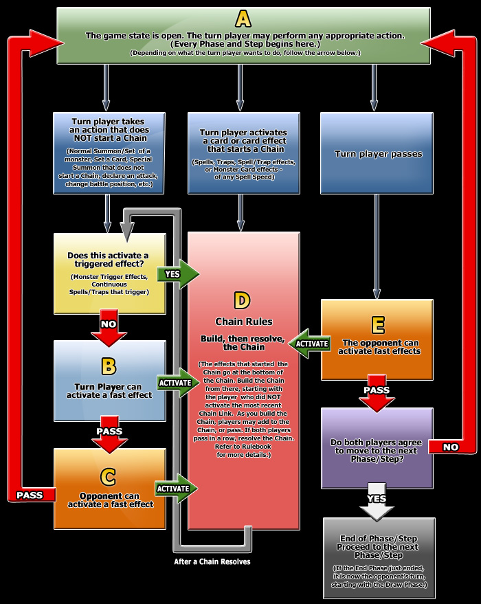

# Démystification de rulings

# Timing d'Effet Rapide

Bien que le jeu n'en donne pas toujours l'impression aujourd'hui, seul un joueur a le droit d'agir à tout moment dans Yu-Gi-Oh!. Dans cet article, nous nous pencherons sur la façon dont les joueurs se passent ce 'droit d'agir' dans les deux sens.

Si vous l'avez manqué, n'oubliez pas de lire le dernier article sur les mécaniques d'[Invocation](06_Invocations.md) !

## Bases
Dans une Chaîne, l'adversaire du joueur dont le dernier effet est ajouté en Chaîne a le droit d'agir en premier. S'il ne souhaite rien activer, il rend ce droit à l'autre joueur. Après que les deux joueurs aient chacun passé, la Chaîne commence à se résoudre. 

Par exemple, supposons que je veux activer *Trou Noir*, et ensuite chaîner *Chemin Poussière d'Étoile* pour l'annuler et Invoquer Spécialement un *Dragon Poussière d'Étoile* :
- *Lorsqu'une carte ou un effet qui va détruire min. 2 cartes que vous contrôlez est activé : annulez l'effet, et si vous le faites, détruisez la carte, puis vous pouvez Invoquer Spécialement 1 "Dragon Poussière d'Étoile" depuis votre Extra Deck.*

<ins>Chain Link 1</ins> : *Trou Noir*

Actuellement, ma carte est la dernière dans la Chaîne, donc mon adversaire a le droit d'activer quelque chose avant que je puisse chaîner mon *Chemin* (s'il le fait, je ne pourrais pas activer *Chemin* puisqu'il doit être chaîné directement à l'effet qu'il essaie d'annuler).

Pour la règle suivante, il vous faudra revenir à l'une des règles du SEGOC : *Si un effet déclencheur tente de s'activer, il est mis sur une Chaîne en accord avec les règles du SEGOC, et seulement après les effets rapides pourront être chaînés*. Après que tous les effets déclencheurs soient mis sur la Chaîne, l'adversaire du joueur dont le dernier effet est entré sur la Chaîne a le droit d'agir ou passer, comme vu plus haut.

## Le Graphe
Il existe bien plus de cas dans lesquels on pourrait se demander quel joueur a le droit d'activer des effets rapides, et ce, sans même penser aux effets non-rapides. Heureusement, Konami a créé un graphe excellent pour nous expliquer précisément quel joueur a le droit d'agir à n'importe quel moment !

Voici dont le graphe de Timing d'Effet Rapide (le graphe n'existe pas en français pour le moment, donc il est en anglais) :

Élégant, n'est-ce pas ? Ce graphe réduit les questions de timing à un simple suivi des flèches.

Pour commencer, un peu de terminologie. Pour clarifier, un effet rapide est simplement un effet Spell Speed 2 ou plus. Ceci inclue un effet de carte Piège au Cimetière, comme *Compétence de Percée* ou des effets sur le Terrain de carte Piège Continue comme *Brouillard des Ténèbres*.

On dit que le Game State (l'état du jeu) est ouvert quand on se trouve dans la boîte A. Lors d'un Game State ouvert, le joueur du tour peut effectuer n'importe quelle action (légale, bien entendu) qu'il veut. Les Game States ouverts sont importants, car il s'agit du seul moment lors duquel les effets non-rapides et actions démarrant des chaînes peuvent être effectuées.

Si le Game State n'est pas ouvert, on dit que le Game State est fermé.

Voyons quelques applications :

*J'entre en Main Phase 1. Puis-je Invoquer Normalement un monstre avant que mon adversaire n'active un effet rapide ?*

Pour cette situation, on se base sur le graphe : dessus, chaque Phase et Step commence en Boîte A. En d'autres termes, c'est un Game State ouvert, ce qui veut dire que le joueur du tour a le droit d'agir, dans notre cas effectuer une Invocation Normale, avant que son adversaire ne puisse agir.

*Après qu'une Chaîne ait résolu, puis-je activer un Effet d'Ignition avant que mon adversaire n'active un effet rapide ?*

La grande boîte dans le milieu du graphe est là pour de la construction de Chaîne. Après qu'une Chaîne ait résolu, une flèche nous amène à la boîte 'Does this activate a trigger effect?' (Est-ce que l'action active un effet déclencheur ?) sur la gauche. En supposant qu'il n'y en a pas, la flèche nous indique ensuite que le joueur du tour et le non-joueur du tour ont le droit d'activer des effets rapides avant que le Game State ne redevienne ouvert (donc avant que l'on revienne en boîte A).

Ce Game State ouvert est le seul endroit dans lequel des Effets d'Ignition peuvent être activés, donc en combinant ces informations, on voit que mon adversaire pourra utiliser un effet rapide avant que j'active mon Effet d'Ignition.

*Puis-je changer de Phase avant que mon adversaire n'active un effet rapide ?*

Déclarer mon intention de finir une Phase nous amène du côté droit du graphe. On y voit que je ne peux pas finir ma Phase jusqu'à ce que mon adversaire ne passe aussi, ce qui veut dire qu'il peut activer un effet avant que la phase ne change.

## C'est l'heure du Quiz !
En utilisant le graphe de Timing d'Effet Rapide, répondez aux questions suivantes :

1. Mon adversaire peut-il activer l'effet de *Illusionniste d'Effet* avant que je ne bouge à la Battle Phase ?
    - *Durant la Main Phase de votre adversaire (Effet Rapide) : vous pouvez envoyer cette carte depuis votre main au Cimetière, puis ciblez 1 Monstre à Effet contrôlé par votre adversaire ; jusqu'à la fin de ce tour, annulez les effets du monstre face recto contrôlé par votre adversaire.*

     

     
Réponse

     

     <strong>Oui.</strong> 

     <i>Nous arrivons sur la droite du Graphe. On peut y voir que le joueur du tour ne peut pas terminer sa Phase sans passer par la Boîte E, dans laquelle l'adversaire peut activer Illusionniste d'Effet.</i>
     

     

2. S'il le peut, puis-je continuer ma Main Phase 1 après son activation ?

     

     
Réponse

     

     <strong>Oui.</strong> 

     <i>Après que n'importe quelle Chaîne ait résolu, on passe par la Boîte 'Est-ce qu'un effet déclencheur a été activé ?', ainsi que les Boîtes B et C, avant de revenir à la Boîte A. Les Phases ne changent donc pas jusqu'à ce que les deux joueurs soient d'accord (comme l'explique le Graphe).</i>
     

     

3. Mon adversaire et moi-même contrôlons tous deux un *Hommage Torrentiel* de Posé. J'invoque normalement *Guide des Enfers* :

   - *Lorsque cette carte est Invoquée Normalement : vous pouvez Invoquer Spécialement 1 monstre Démon de Niveau 3 depuis votre main ou Deck, mais annulez ses effets, et aussi, il ne peut pas être utilisé comme Matériel Synchro.*

    Quel est le premier effet qui peut s'activer ?
    - L'effet de ma *Guide*
    - Mon *Hommage Torrentiel*
    - L'*Hommage Torrentiel* de mon adversaire

     

     
Réponse

     

     <strong>L'effet de <i>Guide des Enfers</i>.</strong> 

     <i>Nous sommes sur le côté gauche du Graphe. La boîte d'après est la boîte 'Est-ce qu'un effet déclencheur est activé ?'.</i>
     

     

4. Si j'active l'effet de *Guide* dans le scénario du dessus, lequel d'entre nous peut chaîner son *Hommage Torrentiel* en premier ?

     

     
Réponse

     

     <strong>Mon adversaire peut activer son <i>Hommage Torrentiel</i> en premier.</strong> 

     <i>Lorsqu'on commence à construire une Chaîne, l'adversaire du joueur dont le dernier effet mis sur la chaîne peut activer le prochain effet.</i>
     

     

Enfin, n'hésitez pas à lire l'[article Konami sur ce sujet](https://www.yugioh-card.com/en/play/fast-effect-timing/) (VPN vers les États-Unis nécessaire pour les consulter).

Le prochain article portera sur la [Battle Phase](08_Battle_Phase.md).

